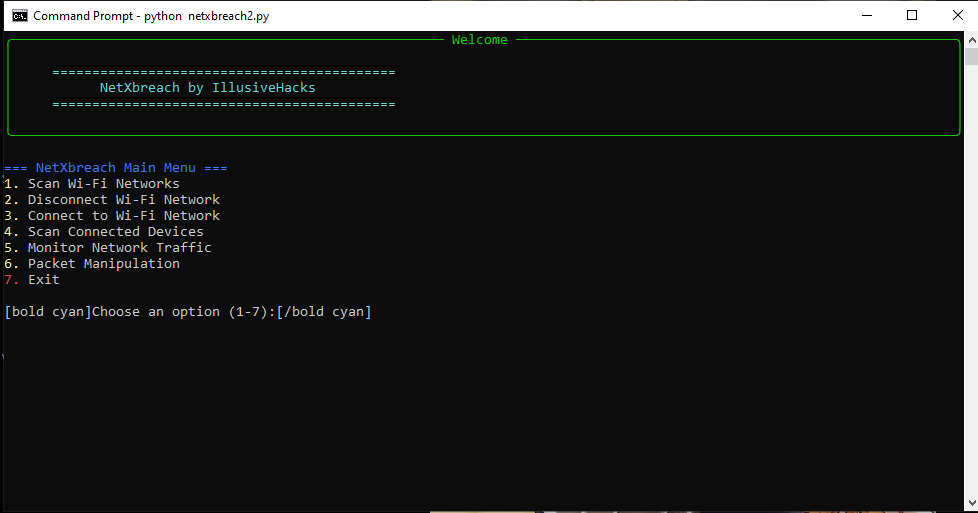
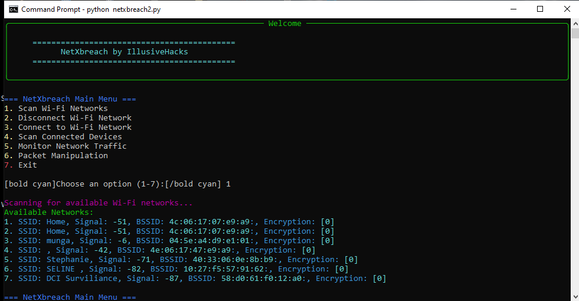

# NetXbreach

NetXbreach is a powerful and interactive Python tool designed for network analysis, monitoring, and penetration testing. It provides capabilities such as scanning Wi-Fi networks, disconnecting from networks, connecting to Wi-Fi, scanning connected devices, monitoring network traffic, and packet manipulation.





---

## Features

### 1. **Wi-Fi Network Scanner**
Scan and list all available Wi-Fi networks along with their SSID, signal strength, BSSID, and encryption type.

### 2. **Wi-Fi Disconnection**
Disconnect from the currently connected Wi-Fi network with a simple command.

### 3. **Wi-Fi Connection**
Connect to a specified Wi-Fi network using its SSID and password.

### 4. **Connected Device Scanner**
Discover all devices connected to a given network range and retrieve details such as:
- IP address
- MAC address
- Hostname
- Operating System
- Services running on open ports

### 5. **Network Traffic Monitoring**
Monitor network traffic in real-time on the selected network interface. Capture details like:
- Source and destination IP addresses
- Protocols (TCP, UDP, ICMP)
- Ports
- Payload data

### 6. **Packet Manipulation**
Perform advanced network packet operations such as:
- ARP spoofing
- Sending custom ICMP packets
- Sending custom TCP packets

---

## Installation

1. Clone the repository:
   ```bash
   git clone https://github.com/Illusivehacks/netxbreach.git
   ```
2. Navigate to the project directory:
   ```bash
   cd
   ```
3. Install the required dependencies:
   ```bash
   pip install -r requirements.txt
   ```

---

## Usage

1. Run the script:
   ```bash
   python netxbreach2.py
   ```
2. Follow the menu prompts to select the desired functionality.

---

## Dependencies

NetXbreach relies on the following Python libraries:
- `os` (Standard Library): For terminal commands.
- `time` (Standard Library): For time-related operations.
- `pywifi`: For Wi-Fi scanning and connection.
- `scapy`: For packet capturing and manipulation.
- `nmap`: For network scanning.
- `rich`: For creating a visually appealing interface.

---

## Preview



---

## How It Works

1. **Interactive Menu:**
   - The tool provides a user-friendly menu for selecting tasks.

2. **Real-Time Feedback:**
   - Outputs results and logs using the `rich` library for better readability.

3. **Customizable Operations:**
   - You can specify network ranges and custom arguments for scans.

---

## Contributing

We welcome contributions to improve NetXbreach! To contribute:
1. Fork the repository.
2. Create a new branch for your feature or bugfix.
3. Submit a pull request.

---

## Disclaimer

NetXbreach is intended for educational purposes and ethical use only. Unauthorized use of this tool on networks without explicit permission is illegal and unethical. The developers are not responsible for any misuse of this tool.

---

## License

This project is licensed under the MIT License. See the LICENSE file for details.

